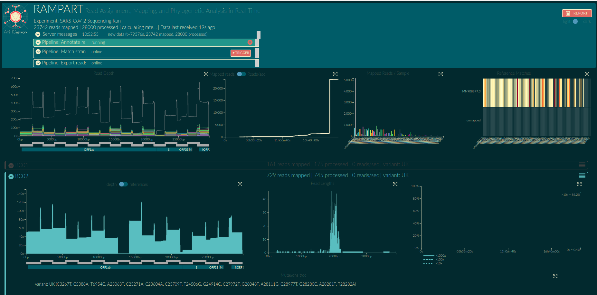

# RAMPART
Read Assignment, Mapping, and Phylogenetic Analysis in Real Time.

RAMPART runs concurrently with MinKNOW and shows you demuxing / mapping results in real time.

## Motivation
Time is crucial in outbreak analysis, and recent advancements in sequencing prep now mean that sequencing is the bottleneck for many pathogens.
Furthermore, the small size of many pathogens mean that insightful sequence data is obtained in a matter of minutes.
RAMPART run concurrently with MinION sequencing of such pathogens.
It provides a real-time overview of genome coverage and reference matching for each barcode.

This version of RAMPART is designed for variant calling of SARS-CoV-2 samples. It uses a simple python script we created for this purpose. You can read more about it [here](docs/barcode_strand_match.md). <!-- #todo -->

## Documentation

* [Installation](docs/installation.md) <!-- * [Running an example dataset & understanding the visualisations](docs/examples.md) -->
* [Setting up for your own run](docs/setting-up.md)
* [Configuring RAMPART using protocols](docs/protocols.md)
* [SARS-CoV-2 strand matching pipeline](docs/barcode_strand_match.md)
* [Running SARS-CoV-2 example](docs/covid_example.md)
